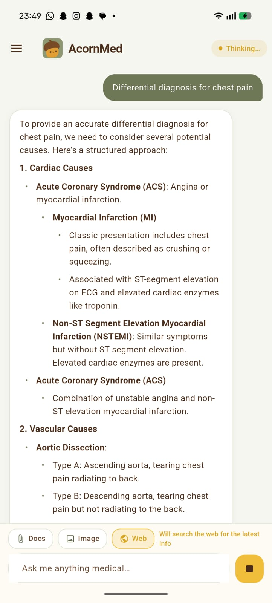
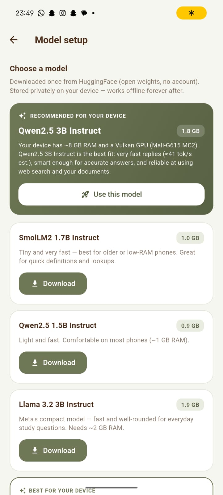
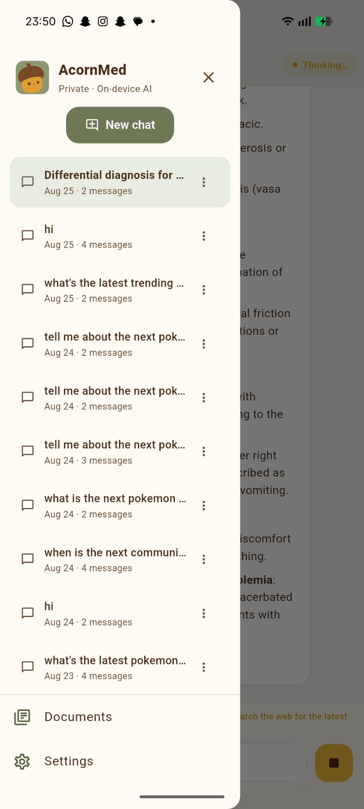
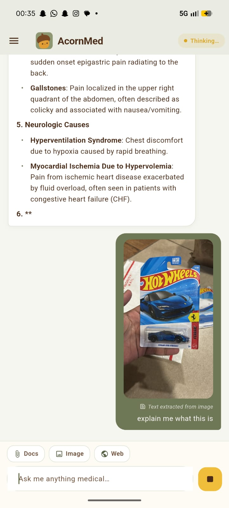
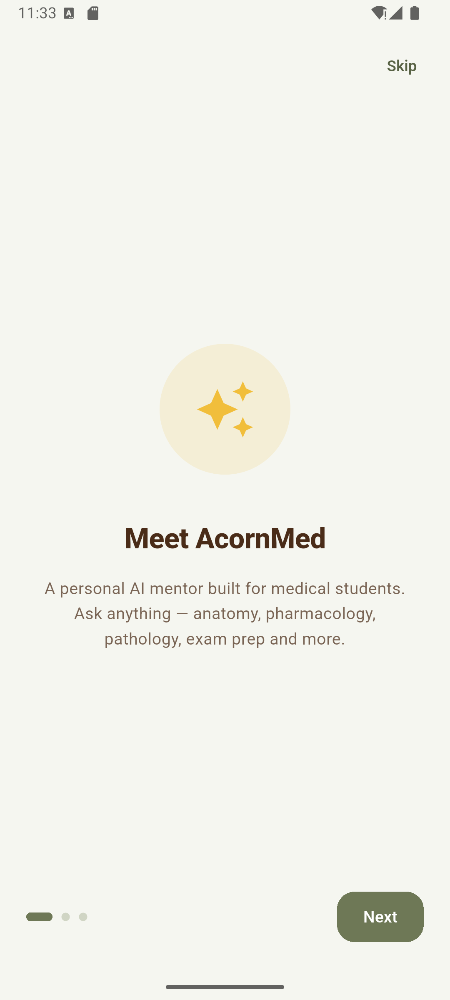
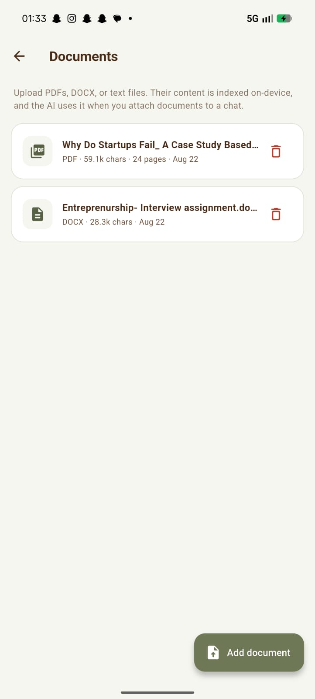
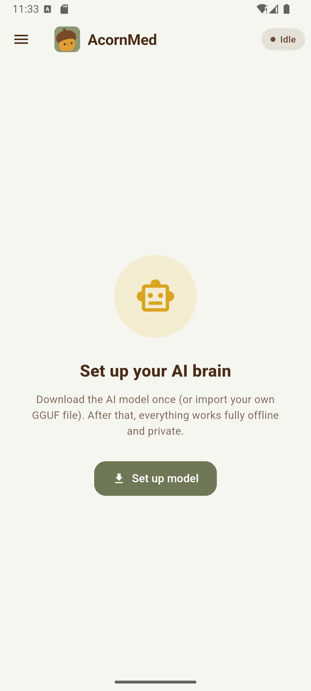
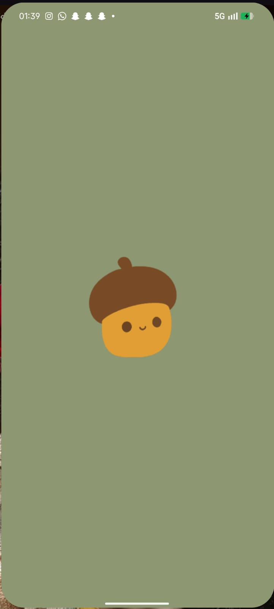

<p align="center">
  
</p>

<h1 align="center">AcornMed</h1>

<p align="center">
  <strong>A privacy-first, offline-capable medical AI assistant for students and clinicians.</strong>
  <br>
  Runs entirely on-device using llama.cpp — no accounts, no API keys, no cloud.
</p>

<p align="center">
  <a href="https://github.com/SparshMishra09/AcornMed/releases"></a>
  <a href="https://github.com/SparshMishra09/AcornMed/blob/main/LICENSE"></a>
  <a href="https://flutter.dev"></a>
  <a href="https://dart.dev"></a>
  <a href="https://github.com/ggerganov/llama.cpp"></a>
  
  
</p>

---

## 🎯 Overview

**AcornMed** is a medical study companion that puts a capable LLM directly on your Android device. Designed for medical students, residents, and clinicians who need reliable, citeable information without compromising patient data or requiring an internet connection.

> **Current release:** `v1.2.0` — see [Releases](https://github.com/SparshMishra09/AcornMed/releases) for signed APKs.

### Why AcornMed?

| Problem | AcornMed Solution |
|---------|-------------------|
| 🏥 Patient data privacy | **100% on-device** — nothing leaves your phone |
| 💰 API costs / rate limits | **Zero API keys** — runs locally via llama.cpp |
| 📶 No internet in hospitals | **Fully offline** core functionality |
| 📚 Scattered resources | **Unified RAG** across 6 medical subjects + your PDFs |
| 🔍 Outdated knowledge | **Optional live web search** (PubMed, Wikipedia, Web) |
| 📸 Image-only materials | **On-device OCR** (ML Kit, no cloud) |

<p align="center">
  <a href="https://github.com/SparshMishra09/AcornMed/releases/latest">
    
  </a>
</p>

<p align="center">
  <strong>Recommended:</strong> <a href="https://github.com/SparshMishra09/AcornMed/releases/download/v1.2.0/AcornMed-v1.2.0-arm64-v8a.apk">arm64-v8a (21.8 MB)</a> — for modern phones<br>
  <strong>All ABIs:</strong> <a href="https://github.com/SparshMishra09/AcornMed/releases/download/v1.2.0/AcornMed-v1.2.0-universal.apk">Universal (45.8 MB)</a> — if unsure or older/32-bit device
</p>

---

## ✨ Features

### 🧠 Local LLM Inference
- **Engine**: llama.cpp via `llama_flutter_android` (ARM64 + x86_64)
- **Models**: Any GGUF (tested with small instruction-tuned models like Qwen2.5-0.5B-Instruct-Q4_K_M, Llama-3.2-1B, Phi-3-mini)
- **Context**: up to 4K tokens (configurable)
- **GPU offload** where the device supports it, with safe CPU fallback
- **No internet required** for core chat

### ⚡ Faster responses (new in v1.2.0)
A toggle in **Settings → Faster responses** tunes the on-device engine for lower latency:
- Trims the context window (4096 → 2048 tokens) and max reply length (1024 → 768 tokens)
- Reduces retrieved-knowledge injection so the model starts answering sooner
- Persisted and re-applied automatically at every app start
- Measured ~15% faster **time-to-first-token** on-device, with decode throughput essentially unchanged

### 🌐 Web Search (Optional, Keyless)
- **PubMed** — Latest biomedical literature via NCBI E-utilities
- **Wikipedia** — General medical concepts via MediaWiki API
- **DuckDuckGo** — General web via HTML scrape (fallback)
- **Auto-detect** freshness queries ("latest guidelines", "2024 treatment")
- **Manual toggle** in chat input bar
- **Smart intercept**: Model emits `[SEARCH: query]` → app searches → re-prompts with results
- **Citations**: Numbered source chips with tappable URLs

### 📄 Document Library (RAG)
- **Formats**: PDF, DOCX, TXT, Markdown
- **Extraction**: Syncfusion PDF + custom DOCX (ZIP/XML) parser
- **Indexing**: TF-IDF + cosine similarity, per-document chunks
- **Per-chat attachment**: Select docs from library → searched first
- **Management**: Documents screen (add/delete/reindex)

### 🖼️ Image OCR (Offline)
- **Source**: Camera or gallery
- **Engine**: Google ML Kit Text Recognition (bundled model, no Play Services)
- **Flow**: Pick → OCR → preview extracted text → send with query
- **Honest about limits**: "I can't see images" for pure visual questions

### 📥 Robust Model Download (new in v1.2.0)
Downloading a model in-app is now production-safe:
- **Integrity verification** — the downloaded file's byte length is checked against the expected size, and (when provided) a **SHA-256 checksum** (`crypto`) is verified
- **Correct resume** — distinguishes HTTP `206` (append) from `200` (restart) so partial downloads are never double-counted
- **Retries** transient network failures up to 3 times with backoff
- **No silent corruption** — a truncated/checksum-mismatched file is discarded and retried instead of being loaded by the engine (which previously crashed on a bad model)
- Friendly, actionable error messages if a download ultimately fails

### 🎨 Polish
- **Real SVG logo** → crisp at any resolution
- **Adaptive launcher icons** (foreground on sage `#8D9771`)
- **Native splash** (Android 8–11 + Android 12+)
- **Dark / Light theme** (sage/cream palette)
- **Riverpod** state management
- **Hive** local storage (conversations, documents, settings)

---

## 📱 Screenshots

| Chat | Model Setup | Navigation Drawer | Image OCR |
|------|-------------|-------------------|-----------|
|  |  |  |  |

| Onboarding | Documents | First Launch | Splash Screen |
|------------|-----------|--------------|---------------|
|  |  |  |  |

---

## 🏗️ Architecture

```
lib/
├── core/
│   ├── theme/           # AppTheme (light/dark), AppColors
│   ├── utils/           # friendly_error, performance_mode
│   └── widgets/         # AppLogo (SVG + fallback)
├── data/
│   ├── models/          # ChatMessage, Conversation, DocumentItem, WebSource (Hive adapters)
│   └── services/
│       ├── ai_engine.dart        # llama.cpp wrapper (load/chat/stop)
│       ├── model_manager.dart    # Model discovery, download + integrity verification
│       ├── storage_service.dart  # Hive boxes (conversations, documents)
│       ├── knowledge_service.dart# TF-IDF RAG (bundled + user docs)
│       ├── document_extractor.dart # PDF/DOCX/TXT text extraction
│       ├── document_service.dart # Import, delete, reindex
│       ├── ocr_service.dart      # ML Kit text recognition
│       └── web_search_service.dart # PubMed/Wiki/DDG search
├── features/
│   ├── home/            # ChatView, HistoryDrawer
│   ├── documents/       # DocumentsScreen (library UI)
│   ├── settings/        # SettingsScreen (faster mode, theme, stats)
│   ├── model_setup/     # ModelSetupScreen (download / GGUF picker)
│   ├── onboarding/      # OnboardingScreen
│   └── splash/          # SplashScreen
├── providers/
│   └── chat_providers.dart   # ChatController (Riverpod Notifier)
└── main.dart
```

### Data Flow

```
User Query
    │
    ├─▶ Attached Doc IDs ──▶ KnowledgeService.retrieve(docIds) ──▶
    │                                                        │
    ├─▶ Web Search (toggle/auto) ──▶ WebSearchService.search() ──▶
    │                                                        │
    └─▶ OCR Text (if image) ─────────────────────────────────▶
                                                              ▼
                                                 buildContext() → System Prompt
                                                              │
                                                              ▼
                                                    llama.cpp Stream
                                                              │
                                                              ▼
                                                    [SEARCH:] intercept?
                                                              │
                                             ┌────────────────┴────────────────┐
                                             ▼                                 ▼
                                       Yes (re-search)                      No (finalize)
                                             │                                 │
                                             ▼                                 ▼
                                     _generate() again                   Save + UI
```

---

## 🚀 Getting Started

### Prerequisites
- **Flutter 3.24+** (Dart 3.5+)
- **Android SDK 34**, NDK 26+
- **Java 17** (for Gradle)
- **Device/emulator** with Android 8.0+ (API 26)

### Install
Download the APK from the [**Download**](https://github.com/SparshMishra09/AcornMed/releases) section above (or from [Releases](https://github.com/SparshMishra09/AcornMed/releases)):
1. Transfer to your phone and open it (allow install from unknown sources if prompted).
2. On first launch, follow onboarding, then **Set up model** (download or import a GGUF).

### Build from source
```bash
# Clone
git clone https://github.com/SparshMishra09/AcornMed.git
cd AcornMed

# Get dependencies
flutter pub get

# (Optional) Generate Hive adapters if models change
dart run build_runner build --delete-conflicting-outputs

# Debug build
flutter run --debug

# Release APK (universal, all ABIs)
flutter build apk --release
# Output: build/app/outputs/flutter-apk/app-release.apk

# Release APK (arm64-v8a only — smaller, recommended for phones)
flutter build apk --release --target-platform android-arm64 --split-per-abi
```

---

## 📥 Model Setup

You have two options:

**1. In-app download (recommended)**
- Open the app → **Set up model** → pick a model from the catalog → **Download**.
- Downloads are verified for completeness (size + optional SHA-256) and resumed automatically; a corrupt download is retried rather than loaded.

**2. Import your own GGUF**
1. Download a GGUF model (e.g., from Hugging Face):
   - `Qwen2.5-0.5B-Instruct-Q4_K_M.gguf` (~0.5 GB, fast on phones)
   - `Llama-3.2-1B-Instruct-Q4_K_M.gguf` (~0.8 GB)
   - `Phi-3-mini-4k-instruct-q4.gguf` (~2.3 GB)
2. Transfer to device (Downloads, Documents, or any folder).
3. Open app → **Set up model** → **Import GGUF** → select the file.
4. The app loads the model (first load ~10–30s depending on device).

> **Tip**: Place a model in `Android/data/com.acornmed.acorn_med/files/` for quick access.

### Available Models

All models are **text-only** — none natively process images. When you attach an image, the app runs on-device OCR (ML Kit) to extract text, then sends that text to the model.

| Model | Size | Quality | Tool Use | Vision | Notes |
|-------|------|---------|----------|--------|-------|
| **SmolLM2 1.7B** | 1.0 GB | ⭐⭐⭐⭐ | ⭐⭐⭐⭐ | Text only | Tiny and fast — best for older/low-RAM phones |
| **Qwen2.5 1.5B** | 0.9 GB | ⭐⭐⭐⭐⭐ | ⭐⭐⭐⭐⭐ | Text only | Light and fast, comfortable on most phones |
| **Llama 3.2 3B** | 1.9 GB | ⭐⭐⭐⭐⭐⭐ | ⭐⭐⭐⭐⭐⭐⭐ | Text only | Meta's compact model, well-rounded for study |
| **Qwen2.5 3B** | 1.8 GB | ⭐⭐⭐⭐⭐⭐⭐ | ⭐⭐⭐⭐⭐⭐⭐⭐ | Text only | Best balance — recommended for most devices |
| **Gemma 3 4B** | 2.4 GB | ⭐⭐⭐⭐⭐⭐⭐ | ⭐⭐⭐⭐⭐⭐⭐ | Text only | Strong factual recall, good for definitions |
| **Phi-4 mini 3.8B** | 2.4 GB | ⭐⭐⭐⭐⭐⭐⭐⭐ | ⭐⭐⭐⭐⭐⭐⭐⭐⭐ | Text only | Excellent reasoning, step-by-step explanations |
| **Qwen2.5 7B** | 4.6 GB | ⭐⭐⭐⭐⭐⭐⭐⭐⭐ | ⭐⭐⭐⭐⭐⭐⭐⭐ | Text only | Smartest option — needs ~5 GB RAM |

> **Image support**: The app extracts text from images via OCR and sends it to the model. For images with no readable text (e.g., photos, diagrams), the model will honestly tell you it cannot see the image directly.

---

## 📖 Usage Guide

### Chat
- Type a medical question → send
- **Web toggle** (🌐 chip): force live search
- **Auto-search**: detected for freshness terms ("latest", "2024", "new guideline")
- **Citations**: tap numbered chips to open source URLs

### Faster responses
- **Settings → Faster responses**: enable for lower time-to-first-token on slower devices. Disable for longer, more thorough answers.

### Attach Documents
1. Tap **📎 Docs** chip in input bar
2. Select from library or tap **Add** → Documents screen → upload
3. Selected docs show badge count on chip
4. Query → RAG searches your docs **first**, then bundled knowledge

### Manage Documents
- **Drawer → Documents** (or from attach sheet)
- **Add**: PDF, DOCX, TXT, MD (multi-select)
- **Delete**: swipe or tap delete icon
- **Reindex**: automatic on app start, or pull-to-refresh in Documents screen

### Image OCR
1. Tap **🖼️ Image** chip → Camera or Gallery
2. App runs on-device OCR (shows progress)
3. Preview extracted text (editable)
4. Send → text included as context for the model

### Settings
- **Faster responses**: trade context length for speed
- **Theme**: Light / Dark / System
- **Knowledge stats**: bundled chunks, your document chunks
- **Privacy**: all local, no telemetry

---

## 🔧 Configuration

### Model Parameters (Settings)
| Parameter | Range | Default | Notes |
|-----------|-------|---------|-------|
| Context length | 512–4096 | 4096 | Higher = more memory |
| Max reply tokens | 256–1024 | 1024 | Lowered to 768 in Faster mode |
| GPU layers | Auto | Device-dependent | CPU-only fallback if unstable |

### Knowledge Base (Bundled)
Six subjects in `assets/knowledge/`:
- `anatomy.md`
- `physiology.md`
- `pharmacology.md`
- `pathology.md`
- `biochemistry.md`
- `microbiology.md`

Add/edit markdown files → rebuild app → auto-indexed on first launch.

### Colors (`lib/core/theme/app_theme.dart`)
```dart
static const sage = Color(0xFF8D9771);        // Primary (logo match)
static const sageDark = Color(0xFF6B7A55);
static const sagePale = Color(0xFFE8ECE3);
static const cream = Color(0xFFFDFBF5);       // Surface
static const coffee = Color(0xFF3D342C);      // Text primary
```

---

## 📦 Dependencies

| Package | Purpose | Version |
|---------|---------|---------|
| `flutter_riverpod` | State management | ^2.6.1 |
| `hive` + `hive_flutter` | Local NoSQL storage | ^2.2.3 / ^1.1.0 |
| `llama_flutter_android` | llama.cpp bindings | ^0.2.6 |
| `crypto` | SHA-256 download verification | ^3.0.3 |
| `http` | Model download / web search | ^1.4.0 |
| `syncfusion_flutter_pdf` | PDF text extraction | ^33.2.13 |
| `archive` | DOCX (ZIP) parsing | ^4.1.0 |
| `google_mlkit_text_recognition` | On-device OCR | ^0.16.0 |
| `image_picker` | Camera/gallery | ^1.2.3 |
| `flutter_svg` | SVG logo rendering | ^2.3.0 |
| `url_launcher` | Open citation URLs | ^6.3.2 |
| `file_picker` | Document selection | ^10.3.3 |
| `uuid` | Unique IDs | ^4.5.1 |
| `intl` | Date formatting | ^0.20.2 |
| `shared_preferences` | Onboarding / prefs | ^2.5.3 |
| `flutter_markdown_plus` | Render model responses | ^1.0.12 |
| `path_provider` | App directories | ^2.1.5 |

---

## 🔐 Privacy & Security

- **No network calls** unless you enable web search or download a model
- **No accounts, no telemetry, no analytics**
- **Model weights** stored in app-private directory
- **Documents** copied to app-private storage, indexed locally
- **Conversations** stored locally via Hive
- **OCR** runs entirely on-device (bundled ML Kit model)
- **Download integrity** verified locally (size + SHA-256) before a model is trusted

---

## 🐛 Troubleshooting

| Issue | Cause | Fix |
|-------|-------|-----|
| "Model not found" | GGUF not in expected location | Settings → Model → pick file |
| "Could not load model" | Insufficient RAM / wrong arch | Use smaller quant (Q3/Q4), close apps |
| Download fails / "didn't finish completely" | Flaky network | App auto-retries; tap Download again |
| Web search returns 0 results | Network / API changes | Check connection, retry |
| Document shows "no readable text" | Scanned PDF / encrypted | OCR the PDF first, or use text-based PDF |
| OCR fails | Image too blurry / no text | Retake photo, ensure good lighting |
| Theme not applying | System theme override | Settings → Theme → explicit Light/Dark |

### Debug Logs
Run with verbose logging:
```bash
flutter run --verbose 2>&1 | grep -E "\[KnowledgeService\]|\[WebSearch\]|\[DocumentService\]"
```

Key log prefixes (debug builds only — stripped in release):
- `[KnowledgeService]` — RAG indexing, retrieval, context building
- `[WebSearch]` — PubMed/Wiki/DDG queries, status codes, result counts
- `[DocumentService]` — Import, extraction, reindex progress
- `[ChatController]` — Search intercept, generation flow

---

## 🗺️ Roadmap

- [x] **In-app model download** with integrity verification + resume
- [x] **Faster responses** mode (lower latency on-device)
- [ ] **Cross-platform**: iOS, Desktop (Windows/macOS/Linux)
- [ ] **Model quantization UI**: Download/convert models in-app
- [ ] **Citation export**: Copy conversation with references
- [ ] **Voice input**: STT for hands-free queries
- [ ] **Anki export**: Generate flashcards from answers
- [ ] **Multi-modal**: Image understanding (when local VLMs mature)
- [ ] **Plugin system**: Custom knowledge packs

---

## 🤝 Contributing

1. Fork → create feature branch
2. Follow existing code style (run `flutter analyze`)
3. Add tests for new functionality
4. Update README if user-facing changes
5. Open PR with clear description

### Code Style
- `flutter analyze` — must pass
- `dart format .` — before commit
- Conventional commits (`feat:`, `fix:`, `docs:`, `refactor:`)

---

## 📄 License

MIT License — see [LICENSE](LICENSE) for details.

> **Medical Disclaimer**: AcornMed is an educational tool. It is **not a substitute for professional medical advice, diagnosis, or treatment**. Always consult qualified clinicians for patient care decisions.

---

## 🙏 Acknowledgments

- **llama.cpp** by Georgi Gerganov — making local LLMs practical
- **Google ML Kit** — on-device OCR without cloud
- **Syncfusion** — PDF text extraction (free community license)
- **NCBI / Wikipedia / DuckDuckGo** — free public APIs
- **Flutter team** — excellent framework
- **Medical students** who tested early builds and gave feedback

---

## 📞 Support

- **Issues**: [GitHub Issues](https://github.com/SparshMishra09/AcornMed/issues)
- **Discussions**: [GitHub Discussions](https://github.com/SparshMishra09/AcornMed/discussions)

---

<p align="center">
  Made with ❤️ for medical students everywhere.<br>
  <sub>Stay curious. Stay offline. Stay accurate.</sub>
</p>
